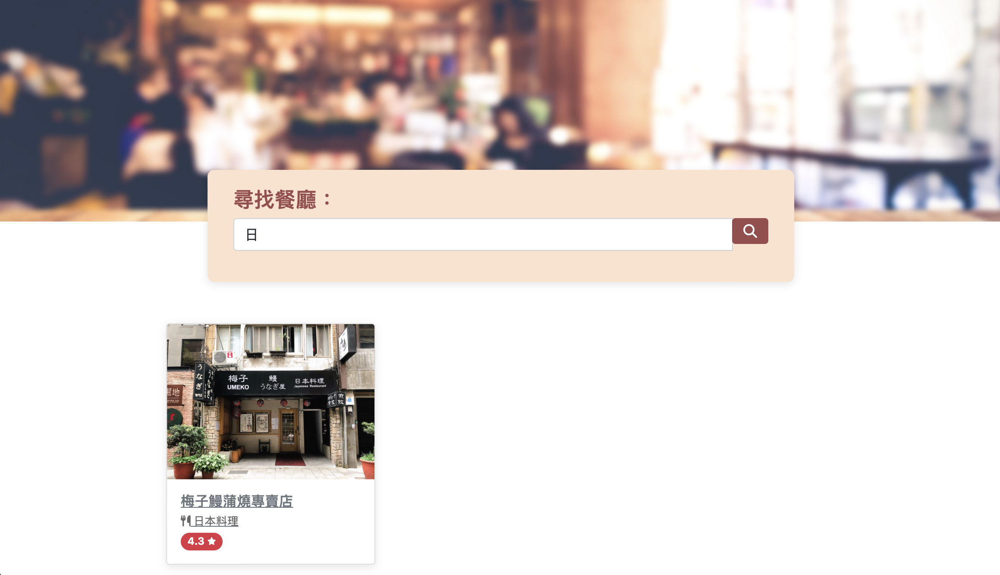

# Alpha Camp Dev C3 M3 - Restaurant List

This is a first update solution Dev C3 M3

## Table of contents

- [Overview](#overview)
  - [The challenge](#the-challenge)
  - [Screenshot](#screenshot)
  - [Links](#links)
- [My process](#my-process)
  - [Built with](#built-with)
  - [What I learned](#what-i-learned)
  - [Continued development](#continued-development)
  - [Useful resources](#useful-resources)
- [Author](#author)
- [Acknowledgments](#acknowledgments)

## Overview

### The challenge

Users should be able to:

- RWD by flex setting

### Screenshot

### Links

- Solution URL: [https://github.com/Chious/Dev-C4-M1-Final](https://github.com/Chious/Dev-C4-M1-Final)
- Live Site URL: [https://chious.github.io/Dev-C4-M1-Final/](https://chious.github.io/Dev-C4-M1-Final/)

## My process

### Built with

- [Express.js](https://expressjs.com) -- backend framework
- [handlebar.js](https://handlebarsjs.com) -- view template to host html without webpack
- [Boostrap](https://getbootstrap.com) -- UI Library

### 處理步驟

### What I learned

### 待迭代

### Useful resources

## Author

- Github - [邱佳昇](https://github.com/Chious)

## Acknowledgments None
